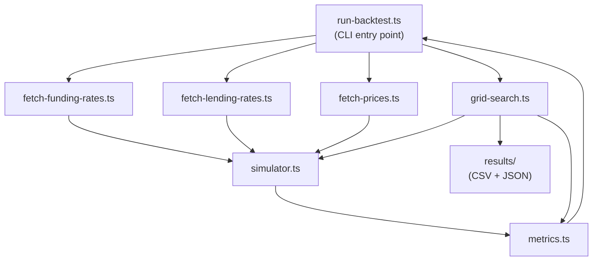

# Design Document: Delta-Neutral Backtest

## Overview

The delta-neutral backtest is a standalone TypeScript simulation toolkit that replays the 50/40/10 delta-neutral funding rate strategy against real historical Drift Protocol mainnet data. It is entirely offline — no on-chain interaction occurs during a run. The toolkit fetches and caches three data streams (funding rates, USDC lending rates, SOL/USD prices), runs a tick-by-tick hourly NAV simulation, computes standardised performance metrics, and optionally sweeps a 192-combination parameter grid to identify the optimal strategy configuration before mainnet deployment.

The toolkit lives in a `backtest/` directory at the repo root, separate from the existing `src/scripts/` operational scripts. It shares the `config/drift.ts` parameter file for single-run defaults but otherwise has no runtime dependency on the Solana SDK or any on-chain programs.

### Key Design Decisions

- **TypeScript + ts-node**: Consistent with the existing repo tech stack; no separate build step.
- **CommonJS modules**: Matches `tsconfig.json` `"module": "commonjs"` setting.
- **Local file cache**: All fetched data is written to `backtest/data/` as JSON files keyed by market and date range. Subsequent runs skip network calls entirely.
- **USDC lending rate sourcing**: Drift does not expose a simple historical lending rate API. The design uses a two-tier fallback: (1) attempt to fetch from the Drift historical data S3 bucket's `spotMarkets` endpoint for USDC utilisation snapshots; (2) if unavailable, fall back to a configurable constant (default 5% APY) and log a warning. This is the most pragmatic approach given the data availability constraints.
- **fast-check for PBT**: The `fast-check` library is the de-facto standard for property-based testing in TypeScript and integrates cleanly with any test runner.
- **No test runner pre-configured**: The design specifies `vitest` as the test runner (lightweight, zero-config for TypeScript, compatible with `fast-check`).

---

## Architecture

The toolkit is structured as a pipeline: data fetching feeds the simulation engine, which feeds the metrics calculator, which feeds the output layer (stdout + files).



### Module Responsibilities

| Module | Responsibility |
|---|---|
| `fetch-funding-rates.ts` | Download + cache Drift S3 funding rate CSVs; parse into `FundingRateRecord[]` |
| `fetch-lending-rates.ts` | Fetch USDC lending rate snapshots (S3 or constant fallback); parse into `LendingRateRecord[]` |
| `fetch-prices.ts` | Fetch hourly SOL/USD OHLC from CoinGecko free API; parse into `PriceRecord[]` |
| `simulator.ts` | Tick-by-tick NAV simulation; returns `TickSnapshot[]` |
| `metrics.ts` | Compute APY, Sharpe, drawdown, rebalance count, health breaches from `TickSnapshot[]` |
| `grid-search.ts` | Cartesian product of parameter axes; runs simulator + metrics per combination; writes CSV + JSON |
| `run-backtest.ts` | CLI arg parsing; orchestrates fetch → simulate → metrics → pass/fail output |

---

## Components and Interfaces

### Data Fetcher Interfaces

```typescript
// Shared cache utility
interface CacheOptions {
  cacheDir: string;       // e.g. "backtest/data"
  cacheKey: string;       // filename stem, e.g. "funding-SOL-PERP-2024"
}

// fetch-funding-rates.ts
interface FundingRateRecord {
  timestamp: number;      // Unix seconds
  market: string;         // "SOL-PERP" | "BTC-PERP"
  fundingRate: number;    // hourly rate as decimal, e.g. 0.0001
}

async function fetchFundingRates(
  market: "SOL-PERP" | "BTC-PERP",
  startTs: number,
  endTs: number,
  opts: CacheOptions
): Promise<FundingRateRecord[]>

// fetch-lending-rates.ts
interface LendingRateRecord {
  timestamp: number;      // Unix seconds
  annualisedRate: number; // e.g. 0.05 = 5% APY
}

async function fetchLendingRates(
  startTs: number,
  endTs: number,
  opts: CacheOptions,
  fallbackRate?: number   // default 0.05
): Promise<LendingRateRecord[]>

// fetch-prices.ts
interface PriceRecord {
  timestamp: number;      // Unix seconds
  closePrice: number;     // USD
}

async function fetchPrices(
  asset: "SOL",
  startTs: number,
  endTs: number,
  opts: CacheOptions
): Promise<PriceRecord[]>
```

### Simulator Interface

```typescript
interface SimulatorParams {
  initialCapital: number;
  shortPerpSizeRatio: number;     // e.g. 0.40
  bufferRatio: number;            // e.g. 0.10
  rebalanceThresholdPct: number;  // e.g. 2 (means 2%)
  minMarginHealthRatio: number;   // e.g. 1.5
}

interface TickSnapshot {
  timestamp: number;
  nav: number;
  spotBalance: number;
  buffer: number;
  shortNotional: number;
  shortSizeInSol: number;
  delta: number;
  marginHealth: number;
  fundingPayment: number;
  lendingYield: number;
  rebalanced: boolean;
  marginBreached: boolean;
  solPrice: number;
}

function simulate(
  params: SimulatorParams,
  fundingRates: FundingRateRecord[],
  lendingRates: LendingRateRecord[],
  prices: PriceRecord[]
): TickSnapshot[]
```

### Metrics Interface

```typescript
interface SimulationMetrics {
  blendedAPY: number;           // percentage, e.g. 18.5
  sharpeRatio: number;
  maxDrawdownPct: number;       // percentage, e.g. 4.2
  rebalanceCount: number;
  negativeFundingHours: number;
  healthBreachesBelow1_5: number;
  healthBreachesBelow1_2: number;
  worstWindow30dAPY: number;    // APY of worst 30-day rolling window
  totalHours: number;
  initialNAV: number;
  finalNAV: number;
}

function computeMetrics(snapshots: TickSnapshot[]): SimulationMetrics
// throws if snapshots.length < 168

function evaluatePassCriteria(metrics: SimulationMetrics): {
  passed: boolean;
  failures: string[];
}
```

### Grid Search Interface

```typescript
interface GridParams {
  shortPerpSizeRatio: number;
  rebalanceThresholdPct: number;
  minMarginHealthRatio: number;
  market: "SOL-PERP" | "BTC-PERP";
}

interface GridResult extends GridParams, SimulationMetrics {}

async function runGridSearch(
  baseParams: Omit<SimulatorParams, "shortPerpSizeRatio" | "rebalanceThresholdPct" | "minMarginHealthRatio">,
  dataByMarket: Record<string, { funding: FundingRateRecord[]; lending: LendingRateRecord[]; prices: PriceRecord[] }>,
  outputDir: string
): Promise<GridResult[]>
```

### CLI Interface

```
pnpm ts-node backtest/run-backtest.ts [options]

Options:
  --market   SOL-PERP | BTC-PERP   (default: SOL-PERP)
  --months   <number>               (default: 12)
  --grid                            run full grid search
```

---

## Data Models

### Aligned Tick Arrays

The simulator requires that `fundingRates`, `lendingRates`, and `prices` arrays are aligned to the same hourly timestamps before simulation begins. The alignment step is performed in `run-backtest.ts` (and `grid-search.ts`) before calling `simulate()`:

1. Compute the intersection of timestamps across all three arrays.
2. For lending rates, apply linear interpolation for any missing hours (per Requirement 2.3).
3. For prices, log a warning if any gap > 2 consecutive hours exists (per Requirement 3.5).
4. Trim all arrays to the requested `--months` lookback window.

```typescript
interface AlignedTick {
  timestamp: number;
  fundingRate: number;
  lendingRate: number;
  solPrice: number;
}

function alignDataSeries(
  funding: FundingRateRecord[],
  lending: LendingRateRecord[],
  prices: PriceRecord[],
  startTs: number,
  endTs: number
): AlignedTick[]
```

### Cache File Format

Each cached dataset is stored as a JSON file in `backtest/data/`:

```
backtest/data/
  funding-SOL-PERP.json       // FundingRateRecord[]
  funding-BTC-PERP.json       // FundingRateRecord[]
  lending-USDC.json           // LendingRateRecord[]
  prices-SOL.json             // PriceRecord[]
```

Cache files are plain JSON arrays. A cache hit is determined by file existence only — no TTL. To force a refresh, delete the relevant file.

### USDC Lending Rate Sourcing Strategy

Drift's S3 bucket exposes a `spotMarkets` endpoint that contains periodic utilisation snapshots for each spot market. The USDC spot market (market index 0) utilisation rate can be converted to a lending rate using Drift's interest rate curve:

```
utilizationRate = totalBorrows / totalDeposits
lendingRate = utilizationRate * borrowRate
```

If the S3 endpoint returns no data or is unavailable, `fetch-lending-rates.ts` falls back to a constant rate (default `0.05` = 5% APY) and logs:

```
[WARN] USDC lending rate data unavailable — using constant fallback rate of 5.00% APY
```

This is explicitly noted in the output so analysts can account for it when interpreting results.

### Output File Schemas

**`grid-search-results.csv`** — one row per combination:
```
shortPerpSizeRatio,rebalanceThresholdPct,minMarginHealthRatio,market,blendedAPY,sharpeRatio,maxDrawdownPct,rebalanceCount,negativeFundingHours,healthBreachesBelow1_5,healthBreachesBelow1_2,worstWindow30dAPY
```

**`grid-search-summary.json`**:
```json
{
  "generatedAt": "2024-01-15T10:00:00Z",
  "totalCombinations": 192,
  "successfulRuns": 192,
  "top5": [ /* GridResult[] ranked by blendedAPY, filtered by drawdown < 10% and zero 1.2 breaches */ ]
}
```

---

## Correctness Properties

*A property is a characteristic or behavior that should hold true across all valid executions of a system — essentially, a formal statement about what the system should do. Properties serve as the bridge between human-readable specifications and machine-verifiable correctness guarantees.*


### Property 1: Parsed records have correct shape

*For any* raw payload returned by a data fetcher (funding rates, lending rates, or prices), every successfully parsed record must contain all required fields with the correct types: `timestamp` as a finite positive number, `fundingRate`/`annualisedRate`/`closePrice` as a finite number, and `market` as a string where applicable.

**Validates: Requirements 1.4, 2.4, 3.4**

### Property 2: Invalid records are filtered from parsed output

*For any* raw funding rate dataset containing a mix of valid records and records with missing or non-numeric `fundingRate` values, the length of the parsed output must equal exactly the count of valid records in the input, and no parsed record may have a non-finite `fundingRate`.

**Validates: Requirements 1.5**

### Property 3: Lending rate interpolation fills all gaps

*For any* lending rate series with missing hours within a requested date range, the interpolated output must contain an entry for every hour in the range, and every interpolated value must lie between the two nearest known surrounding values (linear interpolation invariant).

**Validates: Requirements 2.3**

### Property 4: Price gap warning fires for gaps exceeding 2 hours

*For any* price series where consecutive timestamps differ by more than 2 hours, a warning must be emitted to stdout. Conversely, for any price series with no gap exceeding 2 hours, no gap warning must be emitted.

**Validates: Requirements 3.5**

### Property 5: Initial capital is exactly conserved at tick 0

*For any* valid `SimulatorParams` with `shortPerpSizeRatio + bufferRatio < 1`, the initial state must satisfy: `spotBalance + shortNotional + buffer == initialCapital` (within floating-point epsilon). Equivalently, `spotBalance = initialCapital * (1 - shortPerpSizeRatio - bufferRatio)`, `shortNotional = initialCapital * shortPerpSizeRatio`, `buffer = initialCapital * bufferRatio`.

**Validates: Requirements 4.1, 4.2**

### Property 6: Spot yield accrual is arithmetically exact

*For any* tick with a given `spotBalance` and `lendingRate`, after accrual the new spot balance must equal `spotBalance * (1 + lendingRate / 8760)` within floating-point epsilon.

**Validates: Requirements 4.3**

### Property 7: Positive funding payment accrues to spot balance

*For any* tick where `fundingRate > 0`, the spot balance after the funding step must increase by exactly `shortNotional * fundingRate`, and the buffer must be unchanged.

**Validates: Requirements 4.4**

### Property 8: Negative funding drains buffer before spot balance

*For any* tick where `fundingRate < 0`, let `payment = abs(shortNotional * fundingRate)`. If `buffer >= payment`, then after the tick `buffer` decreases by `payment` and `spotBalance` is unchanged. If `buffer < payment`, then after the tick `buffer == 0` and `spotBalance` decreases by `payment - priorBuffer`.

**Validates: Requirements 4.5**

### Property 9: Short notional tracks current SOL price

*For any* tick, after the price-update step, `shortNotional == shortSizeInSol * currentSolPrice` within floating-point epsilon. The `shortSizeInSol` quantity is conserved across price updates (only rebalance events change it).

**Validates: Requirements 4.6**

### Property 10: Rebalance fires and adjusts notional when threshold is exceeded

*For any* tick state where `abs(delta) / nav > rebalanceThresholdPct / 100`, the resulting snapshot must have `rebalanced == true` and the new `shortNotional` must be closer to `spotBalance` than the pre-rebalance `shortNotional` was.

**Validates: Requirements 4.7**

### Property 11: Margin breach halves short notional

*For any* tick state where `marginHealth < 1.2`, the resulting snapshot must have `marginBreached == true` and `shortNotional_after == shortNotional_before / 2`.

**Validates: Requirements 4.8**

### Property 12: NAV formula invariant holds at every tick

*For any* tick snapshot, `nav == spotBalance + buffer + unrealizedPnl` within floating-point epsilon, where `unrealizedPnl = (entryPrice - currentSolPrice) * shortSizeInSol` (short position gains when price falls).

**Validates: Requirements 4.9**

### Property 13: Simulator output length equals input tick count

*For any* aligned tick array of length N passed to `simulate()`, the returned `TickSnapshot[]` must have exactly N elements.

**Validates: Requirements 4.10**

### Property 14: Blended APY formula is arithmetically correct

*For any* pair `(initialNAV, finalNAV)` with `finalNAV > 0` and `totalHours >= 1`, `computeMetrics` must return `blendedAPY == ((finalNAV / initialNAV) ** (8760 / totalHours) - 1) * 100` within floating-point epsilon.

**Validates: Requirements 5.1**

### Property 15: Sharpe ratio formula is arithmetically correct

*For any* NAV time series, the Sharpe ratio must equal `(meanDailyReturn / stdDevDailyReturn) * sqrt(365)` where daily returns are computed from consecutive daily NAV values. When `stdDevDailyReturn == 0` (flat NAV), Sharpe must be defined as 0 or Infinity (implementation must not throw).

**Validates: Requirements 5.2**

### Property 16: Max drawdown is bounded and zero for monotone-increasing NAV

*For any* NAV time series, `maxDrawdownPct` must be in `[0, 100]`. Additionally, for any strictly non-decreasing NAV series, `maxDrawdownPct` must equal 0.

**Validates: Requirements 5.3**

### Property 17: Metrics counts are consistent with snapshot flags

*For any* `TickSnapshot[]`, the following must hold simultaneously: `rebalanceCount == snapshots.filter(s => s.rebalanced).length`, `negativeFundingHours == snapshots.filter(s => s.fundingPayment < 0).length`, `healthBreachesBelow1_2 == snapshots.filter(s => s.marginHealth < 1.2).length`, and `healthBreachesBelow1_5 == snapshots.filter(s => s.marginHealth < 1.5).length`.

**Validates: Requirements 5.4, 5.5, 5.6**

### Property 18: Top-5 summary respects filter and sort invariants

*For any* array of `GridResult[]`, the top-5 summary must contain only results where `maxDrawdownPct < 10` and `healthBreachesBelow1_2 == 0`, and must be sorted in descending order of `blendedAPY`. If fewer than 5 results pass the filter, the summary contains all passing results.

**Validates: Requirements 6.4**

### Property 19: Pass criteria logic is a pure logical conjunction

*For any* `SimulationMetrics`, `evaluatePassCriteria` must return `passed == true` if and only if `blendedAPY > 15 AND maxDrawdownPct < 10 AND healthBreachesBelow1_2 == 0`. The `failures` array must contain exactly one entry per violated criterion.

**Validates: Requirements 8.1**

### Property 20: Worst 30-day window APY is the minimum over all rolling windows

*For any* NAV time series of length >= 720 ticks, `worstWindow30dAPY` must equal the minimum APY computed over all contiguous 720-tick (30-day) sub-windows. For series shorter than 720 ticks, the entire series is used as the single window.

**Validates: Requirements 8.4**

---

## Error Handling

### Data Fetching Errors

| Condition | Behaviour |
|---|---|
| Drift S3 returns non-200 | Throw `Error("HTTP ${status} fetching ${url}")` |
| CoinGecko returns HTTP 429 | Retry after 60s, up to 3 attempts; then throw |
| No records returned for date range | `run-backtest.ts` exits with code 1 and descriptive message |
| USDC lending rate data unavailable | Fall back to constant 5% APY; log `[WARN]` to stdout |
| Records with invalid numeric fields | Skip and log count: `[INFO] Skipped N invalid records` |

### Simulation Errors

| Condition | Behaviour |
|---|---|
| `shortPerpSizeRatio + bufferRatio >= 1` | Throw `Error("Invalid params: ratios sum to >= 1")` |
| Empty aligned tick array | Throw `Error("No aligned ticks for simulation")` |
| `computeMetrics` called with < 168 ticks | Throw `Error("Insufficient data: need >= 168 ticks")` |

### Grid Search Errors

| Condition | Behaviour |
|---|---|
| Individual combination throws | Log `[ERROR] Combination {params}: ${err.message}`; continue sweep |
| Output directory not writable | Throw immediately before sweep begins |

### Numeric Edge Cases

- All arithmetic uses JavaScript `number` (IEEE 754 double). No `BN` or integer math is needed since this is a simulation, not on-chain.
- Division by zero in Sharpe (zero stdDev) returns `0` rather than `Infinity` or `NaN`.
- Division by zero in margin health (zero shortNotional after full deleveraging) returns `Infinity` — treated as "safe" (no breach recorded).

---

## Testing Strategy

### Test Runner and Libraries

- **Test runner**: `vitest` — zero-config TypeScript support, fast, compatible with `fast-check`
- **Property-based testing**: `fast-check` — the standard PBT library for TypeScript
- **Install**: `pnpm add -D vitest fast-check`
- **Run**: `pnpm vitest --run` (single pass, no watch mode)

### Dual Testing Approach

Unit tests and property tests are complementary. Unit tests cover specific examples, integration points, and error conditions. Property tests verify universal invariants across all valid inputs.

**Unit tests focus on:**
- Cache hit/miss behaviour (mocked `fs` and `fetch`)
- HTTP 429 retry logic (mocked `fetch`)
- CLI argument parsing defaults and overrides
- `computeMetrics` throwing on < 168 ticks
- PASS/FAIL output string formatting
- Grid search CSV and JSON file output (mocked `fs.writeFile`)

**Property tests focus on:**
- All 20 correctness properties listed above
- Each property test runs a minimum of **100 iterations** via `fast-check`

### Property Test Configuration

Each property test must be tagged with a comment referencing the design property:

```typescript
// Feature: delta-neutral-backtest, Property 5: Initial capital is exactly conserved at tick 0
it("initial capital conservation", () => {
  fc.assert(fc.property(
    fc.record({
      initialCapital: fc.float({ min: 1000, max: 1_000_000, noNaN: true }),
      shortPerpSizeRatio: fc.float({ min: 0.1, max: 0.6, noNaN: true }),
      bufferRatio: fc.float({ min: 0.05, max: 0.2, noNaN: true }),
    }).filter(p => p.shortPerpSizeRatio + p.bufferRatio < 1),
    (params) => {
      const ticks = [{ timestamp: 0, fundingRate: 0, lendingRate: 0.05, solPrice: 100 }];
      const result = simulate({ ...params, rebalanceThresholdPct: 2, minMarginHealthRatio: 1.5 }, [], [], ticks);
      const s = result[0];
      expect(s.spotBalance + s.shortNotional + s.buffer).toBeCloseTo(params.initialCapital, 6);
    }
  ), { numRuns: 100 });
});
```

### Test File Structure

```
backtest/
└── __tests__/
    ├── fetch-funding-rates.test.ts   // Properties 1, 2; cache-hit example; HTTP error example
    ├── fetch-lending-rates.test.ts   // Properties 1, 3; cache-hit example
    ├── fetch-prices.test.ts          // Properties 1, 4; cache-hit example; 429 retry example
    ├── simulator.test.ts             // Properties 5–13
    ├── metrics.test.ts               // Properties 14–17, 20; insufficient-data example
    ├── grid-search.test.ts           // Property 18; 192-combination count example; error-resilience example
    └── pass-criteria.test.ts         // Property 19; PASS/FAIL output examples
```

### Coverage Goals

- All 20 correctness properties implemented as property-based tests
- All error conditions covered by at least one unit test example
- No property test with fewer than 100 `fast-check` iterations
