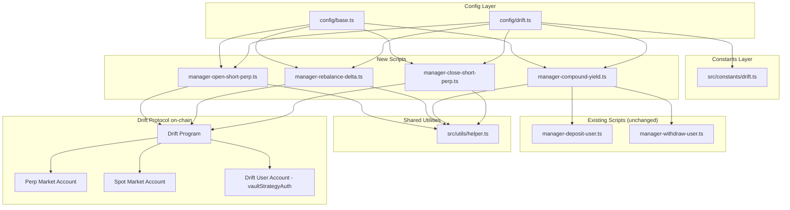

# Design Document: Delta-Neutral Funding Rate Strategy

## Overview

This feature extends the existing Voltr vault scripting toolkit to support a delta-neutral funding rate harvesting strategy on Drift Protocol. The vault deploys USDC in a 50/40/10 split: 50% to Drift spot USDC lending, 40% as margin for a short perpetual position (SOL-PERP or BTC-PERP), and 10% held as a liquid buffer. Four new manager scripts handle the full perp lifecycle, and two existing files (`src/constants/drift.ts` and `config/drift.ts`) are extended with perp-specific constants and parameters.

The strategy is built entirely on top of existing infrastructure — the `drift_user` adaptor PDA, `DriftClient` from `@drift-labs/sdk`, `sendAndConfirmOptimisedTx` from `src/utils/helper.ts`, and the versioned transaction pattern already used by all other scripts.

## Architecture



### Key Design Decisions

- **No new shared utilities**: All four scripts follow the same self-contained pattern as existing manager scripts. Perp-specific logic (building the order params, reading position data) is inlined per script rather than extracted to a helper, keeping each script independently readable.
- **Compound via existing scripts' logic**: `manager-compound-yield.ts` reuses the same instruction-building pattern as `manager-withdraw-user.ts` and `manager-deposit-user.ts` inline rather than importing them as modules, consistent with the standalone script convention.
- **Config-driven, no hardcoding**: All market indices, ratios, and thresholds come from `config/drift.ts`. Scripts never hardcode addresses or amounts.
- **Margin health checked before every perp action**: Both `manager-rebalance-delta.ts` and `manager-compound-yield.ts` read health before acting, with hard stops at 1.2 and soft warnings at 1.5.

## Components and Interfaces

### 1. `src/constants/drift.ts` — Extension

Add a `PERP` namespace to the existing `DRIFT` object:

```typescript
export const DRIFT = {
  // ... existing fields unchanged ...
  PERP: {
    SOL: { MARKET_INDEX: 1 },
    BTC: { MARKET_INDEX: 2 },
  },
};
```

No other changes to this file.

### 2. `config/drift.ts` — Extension

Add perp strategy parameters below the existing exports:

```typescript
import { BN } from "@coral-xyz/anchor";
import { DRIFT } from "../src/constants/drift";

// ... existing exports unchanged ...

// PERP STRATEGY PARAMETERS
export const perpMarketIndex = DRIFT.PERP.SOL.MARKET_INDEX;
export const shortPerpSizeRatio = 0.40;       // fraction of NAV to deploy as short notional
export const bufferRatio = 0.10;              // fraction of NAV to hold as liquid USDC
export const rebalanceThresholdPct = 2;       // delta deviation % that triggers rebalance
export const minMarginHealthRatio = 1.5;      // health floor; below this, no size increases
export const perpOrderSize = new BN(1_000_000_000); // 1 SOL in base asset units (9 decimals)
```

`perpOrderSize` is expressed in the perp market's base asset units. For SOL-PERP, Drift uses 9-decimal precision, so `1_000_000_000` = 1 SOL. Operators adjust this before running open/rebalance scripts.

### 3. `manager-open-short-perp.ts`

Opens a short perpetual position on Drift via `placeAndTakePerpOrder`.

**Key function signature:**

```typescript
const openShortPerp = async (
  protocolProgram: PublicKey,
  perpMarketIndex: number,
  orderSize: BN,
  subAccountId: BN,
  lookupTableAddresses: string[]
): Promise<void>
```

**Data flow:**

```
1. Load payerKp from MANAGER_FILE_PATH
2. Derive strategy PDA: [Buffer.from("drift_user"), ADAPTOR_PROGRAM_ID]
3. Derive vaultStrategyAuth via vc.findVaultStrategyAddresses(vault, strategy)
4. Derive user PDA: [Buffer.from("user"), vaultStrategyAuth, subAccountId (le2)]
5. Derive userStats PDA: [Buffer.from("user_stats"), vaultStrategyAuth]
6. Create DriftClient, subscribe
7. Fetch userAccounts = driftClient.getUserAccountsForAuthority(vaultStrategyAuth)
8. Build orderParams: { orderType: OrderType.MARKET, direction: PositionDirection.SHORT,
                        baseAssetAmount: orderSize, marketIndex: perpMarketIndex }
9. Build ix = driftClient.getPlaceAndTakePerpOrderIx(orderParams, subAccountId)
10. Build remainingAccounts via driftClient.getRemainingAccounts({
      userAccounts, writablePerpMarketIndexes: [perpMarketIndex] })
11. driftClient.unsubscribe()
12. sendAndConfirmOptimisedTx([ix], HELIUS_RPC_URL, payerKp, [], lutAccounts)
13. Log txSig
```

### 4. `manager-rebalance-delta.ts`

Reads current spot and perp positions, computes delta, and adjusts the short if deviation exceeds threshold.

**Key function signature:**

```typescript
const rebalanceDelta = async (
  protocolProgram: PublicKey,
  spotMarketIndex: number,
  perpMarketIndex: number,
  subAccountId: BN,
  lookupTableAddresses: string[]
): Promise<void>
```

**Data flow:**

```
1. Load payerKp from MANAGER_FILE_PATH
2. Derive PDAs (same as open-short-perp)
3. Create DriftClient, subscribe
4. user = driftClient.getUser(subAccountId, vaultStrategyAuth)
5. healthRatio = user.getHealth() / 100
6. IF healthRatio < 1.2:
     → build reduce-only order (50% of current short size)
     → submit, log warning, exit
7. perpPosition = user.getPerpPosition(perpMarketIndex)
8. spotPosition = user.getSpotPosition(spotMarketIndex)
9. Compute spot_notional and abs(short_perp_notional) from position data
10. current_delta = spot_notional - abs(short_perp_notional)
11. IF abs(current_delta / total_nav) <= rebalanceThresholdPct / 100:
      → log "no rebalance needed", exit
12. IF healthRatio < minMarginHealthRatio AND delta requires increasing short:
      → log warning, exit without increasing
13. Compute adjustment size and direction (LONG to reduce short, SHORT to increase)
14. Build and submit placeAndTakePerpOrder ix
15. Log new delta and txSig
```

**Delta computation:**

```
spot_notional    = spotPosition.scaledBalance × oracle_price   (USDC terms)
perp_notional    = abs(perpPosition.baseAssetAmount) × oracle_price
current_delta    = spot_notional - perp_notional
delta_pct        = abs(current_delta) / total_nav
```

`total_nav` is approximated as `user.getFreeCollateral()` plus the current position value. For the threshold check, using `getFreeCollateral()` as a conservative proxy is acceptable.

### 5. `manager-compound-yield.ts`

Computes withdrawable yield above the margin safety floor, withdraws it, and re-deposits it into the Drift spot market.

**Key function signature:**

```typescript
const compoundYield = async (
  protocolProgram: PublicKey,
  spotMarketIndex: number,
  perpMarketIndex: number,
  subAccountId: BN,
  lookupTableAddresses: string[]
): Promise<void>
```

**Data flow:**

```
1. Load payerKp from MANAGER_FILE_PATH
2. Derive PDAs
3. Create DriftClient, subscribe
4. user = driftClient.getUser(subAccountId, vaultStrategyAuth)
5. healthRatio = user.getHealth() / 100
6. IF healthRatio cannot be read → throw error
7. freeCollateral = user.getFreeCollateral()  (BN, 6 decimals USDC)
8. Compute required_margin = current_short_notional / minMarginHealthRatio
9. withdrawable = freeCollateral - required_margin
10. IF withdrawable <= 0 → log "no yield to compound", exit
11. Build withdraw instruction (same pattern as manager-withdraw-user.ts)
12. Submit withdraw tx, log txSig1
13. Build deposit instruction (same pattern as manager-deposit-user.ts)
14. Submit deposit tx, log txSig2
15. Log compounded amount, txSig1, txSig2
16. driftClient.unsubscribe()
```

### 6. `manager-close-short-perp.ts`

Reads the current short position size and submits a LONG market order of equal size to fully close it.

**Key function signature:**

```typescript
const closeShortPerp = async (
  protocolProgram: PublicKey,
  perpMarketIndex: number,
  subAccountId: BN,
  lookupTableAddresses: string[]
): Promise<void>
```

**Data flow:**

```
1. Load payerKp from MANAGER_FILE_PATH
2. Derive PDAs
3. Create DriftClient, subscribe
4. user = driftClient.getUser(subAccountId, vaultStrategyAuth)
5. perpPosition = user.getPerpPosition(perpMarketIndex)
6. IF perpPosition is null OR baseAssetAmount == 0:
     → log "no open position", exit
7. closeSize = abs(perpPosition.baseAssetAmount)
8. Build orderParams: { orderType: OrderType.MARKET, direction: PositionDirection.LONG,
                        baseAssetAmount: closeSize, marketIndex: perpMarketIndex,
                        reduceOnly: true }
9. Build ix = driftClient.getPlaceAndTakePerpOrderIx(orderParams, subAccountId)
10. Build remainingAccounts via getRemainingAccounts({ writablePerpMarketIndexes: [perpMarketIndex] })
11. driftClient.unsubscribe()
12. sendAndConfirmOptimisedTx([ix], HELIUS_RPC_URL, payerKp, [], lutAccounts)
13. Log closed size and txSig
```

## Data Models

### PDA Derivation (shared across all scripts)

```typescript
// Strategy PDA (same seed as existing scripts)
const [strategy] = PublicKey.findProgramAddressSync(
  [Buffer.from("drift_user")],
  new PublicKey(ADAPTOR_PROGRAM_ID)
);

// vaultStrategyAuth — the Drift sub-account authority
const { vaultStrategyAuth } = vc.findVaultStrategyAddresses(vault, strategy);

// Drift User account
const [user] = PublicKey.findProgramAddressSync(
  [Buffer.from("user"), vaultStrategyAuth.toBuffer(), subAccountId.toArrayLike(Buffer, "le", 2)],
  protocolProgram
);

// Drift UserStats account
const [userStats] = PublicKey.findProgramAddressSync(
  [Buffer.from("user_stats"), vaultStrategyAuth.toBuffer()],
  protocolProgram
);
```

### Perp Order Params

```typescript
interface PerpOrderParams {
  orderType: OrderType;           // OrderType.MARKET for all scripts
  direction: PositionDirection;   // SHORT to open/increase, LONG to close/reduce
  baseAssetAmount: BN;            // in base asset units (9 decimals for SOL)
  marketIndex: number;            // perpMarketIndex from config
  reduceOnly?: boolean;           // true for close and margin-triggered reductions
}
```

### Position State (read from Drift SDK)

```typescript
// From user.getPerpPosition(marketIndex)
interface PerpPosition {
  baseAssetAmount: BN;   // negative for short positions
  quoteAssetAmount: BN;  // unrealized P&L in USDC
  marketIndex: number;
}

// From user.getSpotPosition(marketIndex)
interface SpotPosition {
  scaledBalance: BN;     // balance in spot market token units
  marketIndex: number;
}

// Health and collateral
const healthRatio: number = user.getHealth() / 100;  // 0.0–1.0+ scale
const freeCollateral: BN = user.getFreeCollateral();  // USDC, 6 decimals
```

### Config Parameters Summary

| Export | Type | Value | Purpose |
|---|---|---|---|
| `perpMarketIndex` | `number` | `DRIFT.PERP.SOL.MARKET_INDEX` (1) | Target perp market |
| `shortPerpSizeRatio` | `number` | `0.40` | Fraction of NAV as short notional |
| `bufferRatio` | `number` | `0.10` | Fraction of NAV as liquid buffer |
| `rebalanceThresholdPct` | `number` | `2` | Delta % trigger for rebalance |
| `minMarginHealthRatio` | `number` | `1.5` | Health floor for de-risking |
| `perpOrderSize` | `BN` | `1_000_000_000` | Base order size (1 SOL, 9 dec) |

## Correctness Properties

*A property is a characteristic or behavior that should hold true across all valid executions of a system — essentially, a formal statement about what the system should do. Properties serve as the bridge between human-readable specifications and machine-verifiable correctness guarantees.*

### Property 1: PERP namespace is structurally complete

*For any* import of `DRIFT` from `src/constants/drift.ts`, the values `DRIFT.PERP.SOL.MARKET_INDEX` and `DRIFT.PERP.BTC.MARKET_INDEX` must be defined numeric values equal to 1 and 2 respectively.

**Validates: Requirements 1.1, 1.2, 1.3, 1.4**

---

### Property 2: Config exports are type-correct and reference PERP constants

*For any* import of `config/drift.ts`, `perpMarketIndex` must equal `DRIFT.PERP.SOL.MARKET_INDEX`, `shortPerpSizeRatio` must equal `0.40`, `bufferRatio` must equal `0.10`, `rebalanceThresholdPct` must equal `2`, `minMarginHealthRatio` must equal `1.5`, and `perpOrderSize` must be a `BN` instance with a positive value.

**Validates: Requirements 2.1, 2.2, 2.3, 2.4, 2.5, 2.6, 2.7**

---

### Property 3: Delta computation is consistent with position data

*For any* spot notional value and short perp notional value, `current_delta = spot_notional - abs(short_perp_notional)` must satisfy: if `abs(current_delta / total_nav) > rebalanceThresholdPct / 100` then a rebalance order is submitted; otherwise no transaction is submitted.

**Validates: Requirements 4.2, 4.3, 4.4**

---

### Property 4: Rebalance is suppressed when health is below floor

*For any* Drift sub-account state where `healthRatio < minMarginHealthRatio` and the delta computation would require increasing the short position, no order that increases the short position size shall be submitted.

**Validates: Requirements 4.7, 7.2**

---

### Property 5: Critical health triggers reduce-only order

*For any* Drift sub-account state where `healthRatio < 1.2`, the script must submit a reduce-only order that decreases the short position size by 50%, regardless of current delta direction.

**Validates: Requirements 7.3, 7.4**

---

### Property 6: Compound yield is non-negative

*For any* Drift sub-account state, the withdrawable yield computed as `freeCollateral - required_margin` must be greater than zero before any withdraw or deposit transaction is submitted. If the value is zero or negative, no transaction is submitted.

**Validates: Requirements 5.1, 5.5**

---

### Property 7: Compound is idempotent under zero-yield state

*For any* Drift sub-account state where no new yield has accrued (free collateral equals required margin), executing `manager-compound-yield.ts` any number of times produces the same outcome as executing it once — no transactions are submitted and the account state is unchanged.

**Validates: Requirements 8.3**

---

### Property 8: Close position round-trip

*For any* non-zero short perp position, executing `manager-open-short-perp.ts` followed by `manager-close-short-perp.ts` (with no intervening price change) must result in a Drift sub-account with zero open perp positions for that market index.

**Validates: Requirements 6.1, 6.2, 8.2**

---

### Property 9: Close is a no-op when no position exists

*For any* Drift sub-account state where `getPerpPosition(perpMarketIndex)` returns null or zero `baseAssetAmount`, `manager-close-short-perp.ts` must not submit any transaction.

**Validates: Requirements 6.6**

---

### Property 10: Health unreadable halts execution

*For any* script execution where the margin health ratio cannot be read from the Drift sub-account, the script must throw an error and halt before submitting any transaction.

**Validates: Requirements 7.5**

## Error Handling

### Transaction Simulation Failures

`sendAndConfirmOptimisedTx` already simulates before sending and throws if `unitsConsumed` is null. Scripts rely on this — no additional simulation wrapper is needed. If simulation fails (e.g., insufficient margin, invalid order size), the error propagates up and the script exits with a non-zero code.

### Missing or Zero Position (close script)

`manager-close-short-perp.ts` checks `perpPosition` before building any instruction. If null or `baseAssetAmount.isZero()`, it logs and exits cleanly — no error thrown, since this is an expected operational state.

### Health Below Critical Threshold

`manager-rebalance-delta.ts` and `manager-compound-yield.ts` check health before any perp action:
- `health < 1.2`: submit reduce-only 50% order, log warning, exit
- `health < 1.5` AND action would increase short: log warning, exit without submitting
- `health` unreadable (SDK throws): re-throw with descriptive message, halt

### Zero Yield in Compound Script

If `withdrawable <= 0`, log "no yield available to compound" and exit with code 0. This is not an error — it is the expected state when the script runs before yield has accrued.

### Environment Variable Validation

All scripts fail fast at startup if `MANAGER_FILE_PATH` or `HELIUS_RPC_URL` are missing (the `!` non-null assertion on `process.env` causes an immediate throw, consistent with existing scripts).

### DriftClient Lifecycle

All scripts call `driftClient.unsubscribe()` in a `finally` block to prevent hanging WebSocket connections, even if an error occurs mid-execution.

## Testing Strategy

### Unit Tests

Unit tests focus on the pure computation logic that can be tested without on-chain state:

- Delta computation: given mock spot and perp notional values, verify `current_delta` and the threshold comparison produce the correct branch decision
- Yield computation: given mock `freeCollateral` and `required_margin` BN values, verify `withdrawable` is computed correctly and the zero-guard works
- Health guard logic: given health values at 1.19, 1.20, 1.49, 1.50, verify the correct action branch is taken
- Config value assertions: verify all exports from `config/drift.ts` have the correct types and values
- Constants assertions: verify `DRIFT.PERP.SOL.MARKET_INDEX === 1` and `DRIFT.PERP.BTC.MARKET_INDEX === 2`

### Property-Based Tests

Property tests use a PBT library (recommended: `fast-check` for TypeScript) with a minimum of 100 iterations per property.

Each test is tagged with a comment in the format:
`// Feature: delta-neutral-funding-rate-strategy, Property N: <property_text>`

**Property 1 — PERP namespace completeness**
Generate: no generation needed (static assertion)
Test: `DRIFT.PERP.SOL.MARKET_INDEX === 1 && DRIFT.PERP.BTC.MARKET_INDEX === 2`

**Property 2 — Config type correctness**
Generate: no generation needed (static assertion)
Test: all config exports match expected types and values

**Property 3 — Delta threshold branching**
Generate: arbitrary `spot_notional`, `perp_notional`, `total_nav` (positive numbers)
Test: `shouldRebalance(spot, perp, nav) === (abs(spot - abs(perp)) / nav > 0.02)`

**Property 4 — Health suppresses short increase**
Generate: arbitrary health values in `[0.0, 1.5)`, arbitrary delta requiring short increase
Test: `shouldIncreaseShort(health, delta) === false` when `health < 1.5`

**Property 5 — Critical health triggers reduce-only**
Generate: arbitrary health values in `[0.0, 1.2)`, arbitrary position sizes
Test: `getAction(health, position) === { type: "reduce", size: position * 0.5, reduceOnly: true }`

**Property 6 — Compound yield non-negative guard**
Generate: arbitrary `freeCollateral` and `required_margin` BN values
Test: `computeWithdrawable(fc, rm) > 0` iff `fc > rm`; if `<= 0`, no tx is submitted

**Property 7 — Compound idempotence under zero yield**
Generate: arbitrary account states where `freeCollateral <= required_margin`
Test: calling compound logic twice produces the same result as calling it once (no state change, no tx)

**Property 8 — Close round-trip**
Generate: arbitrary non-zero short position sizes
Test: `openThenClose(size)` results in `getPerpPosition().baseAssetAmount === 0`
(integration test against Drift devnet or a mock)

**Property 9 — Close no-op on empty position**
Generate: null or zero `baseAssetAmount` perp positions
Test: `shouldSubmitClose(position) === false`

**Property 10 — Health unreadable halts**
Generate: mock DriftClient that throws on `getHealth()`
Test: script throws before any instruction is built
